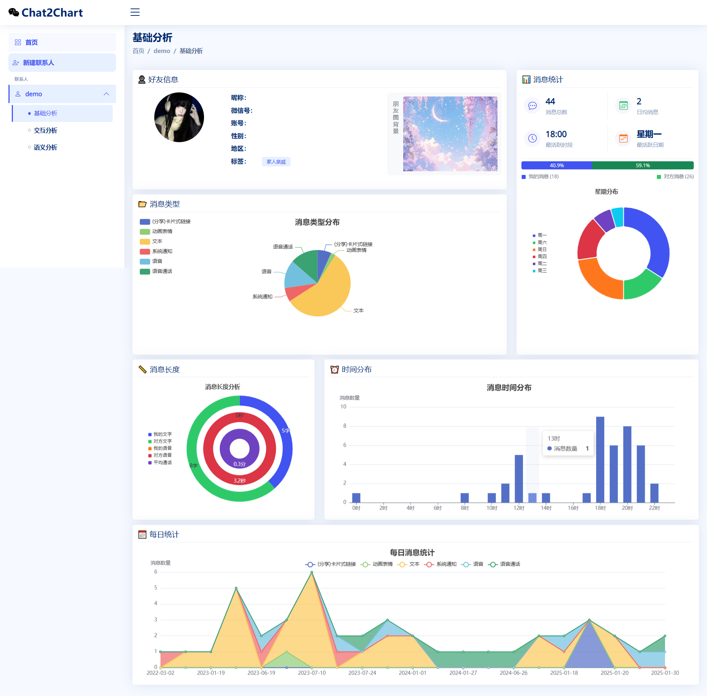
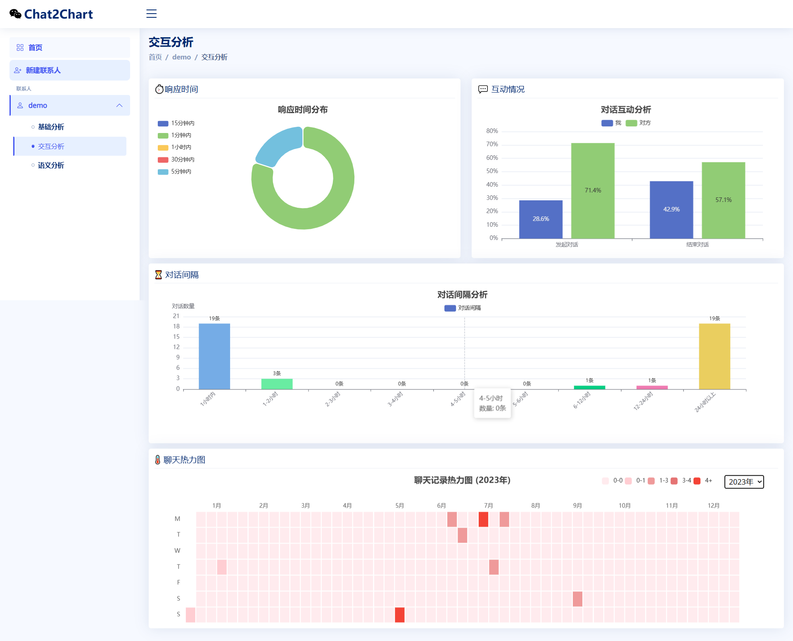
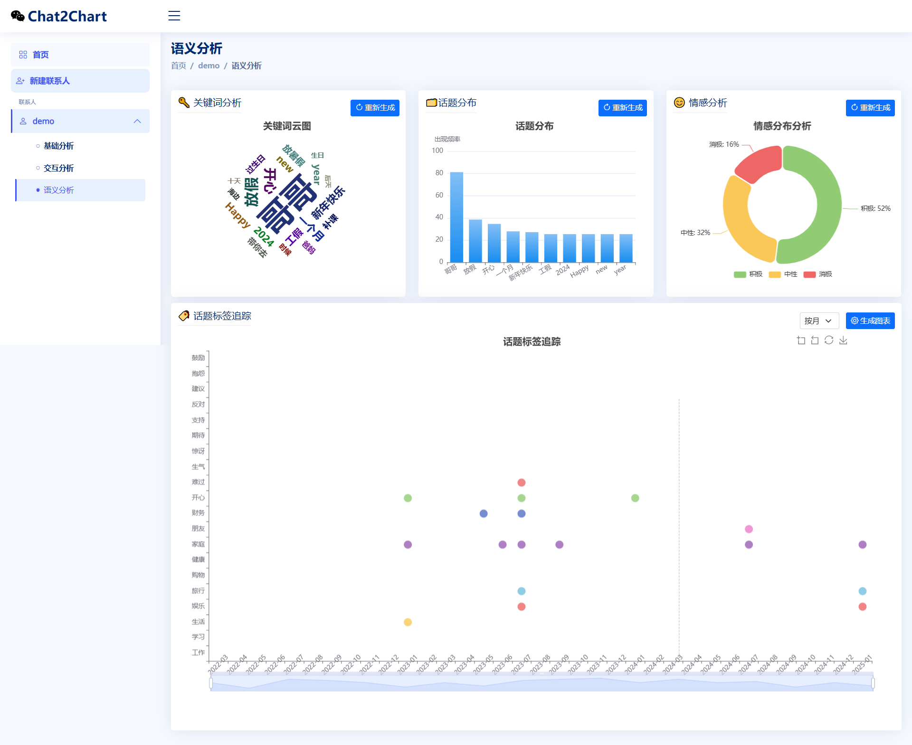

# Chat2Chart - 微信聊天记录可视化工具

Chat2Chart 是一个强大的微信聊天记录分析工具，它能够将聊天数据转化为直观的图表，帮助用户深入了解聊天互动模式和沟通习惯。

## 主要功能

### 基础分析
- **消息类型统计**：展示文字、图片、语音等各类消息的分布比例
- **时间分布分析**：分析每日各时段的消息频率，了解活跃时间
- **消息长度分析**：统计文字长度和语音时长，对比双方表达习惯
- **每日统计图表**：追踪每日消息数量变化，展示聊天频率趋势

### 交互分析
- **对话模式分析**：分析对话间隔和连续对话特征，展示互动模式
- **响应时间分析**：统计双方回复速度，了解互动积极程度
- **聊天热力图**：可视化展示全年聊天活跃度的时间分布
- **互动情况分析**：分析对话的发起和结束特征，展示互动主动性

### 语义分析
- **关键词云图**：提取高频关键词，直观展示聊天主题重点
- **话题分布**：分析聊天内容的主题分类和占比情况
- **情感分析**：分析对话的情感倾向，展示情感变化趋势
- **话题追踪**：追踪特定话题的出现时间和讨论热度

## 安装说明

1. 克隆项目
   ```bash
   git clone https://github.com/yourusername/chat2chart.git
   cd chat2chart
   ```

2. 创建并激活虚拟环境
   ```bash
   python -m venv venv
   source venv/bin/activate # Linux/Mac
   venv\Scripts\activate # Windows
   ```

3. 安装依赖
   ```bash
   pip install -r requirements.txt
   ```

4. 运行项目
   ```bash
   python app.py
   ```

## 使用说明

1. **准备工作**：本项目的聊天记录需要通过 [PyWxDump](https://github.com/yourusername/PyWxDump) 项目导出为 CSV 文件。具体导出步骤请访问其仓库。
2. 启动应用后，访问 [http://localhost:8080](http://localhost:8080)
3. 点击"新建联系人"添加聊天记录
4. 输入联系人姓名和聊天记录路径（聊天记录路径是PyWxDump导出的CSV文件路径，参考：“wxdump_work\export\wxid_xxx\csv\wxid_xxx”）
5. 系统会自动分析并生成可视化图表
6. 在侧边栏选择不同的分析维度查看详细数据

## 主要功能

### 基础分析
以下是基础分析的示例图表：



### 交互分析
以下是交互分析的示例图表：



### 语义分析
以下是语义分析的示例图表：



## 技术栈

- **后端**：Python Flask
- **前端**：Bootstrap 5, ECharts
- **数据分析**：Pandas, NumPy
- **数据可视化**：ECharts

## 目录结构

```
chat2chart/
├── app.py # 应用入口
├── config.py # 配置文件
├── requirements.txt # 项目依赖
├── static/ # 静态文件
│   ├── css/ # 样式文件
│   ├── js/ # JavaScript文件
│   ├── img/ # 图片资源
│   └── vendor/ # 第三方库
├── templates/ # 模板文件
│   ├── base.html # 基础模板
│   ├── index.html # 首页
│   └── analysis/ # 分析页面
├── utils/ # 工具函数
└── routes/ # 路由文件
```

## 开发环境

- Python 3.8+
- Node.js 14+（用于前端开发）
- 现代浏览器（Chrome, Firefox, Safari, Edge）

## 贡献指南

1. Fork 本仓库
2. 创建特性分支 (`git checkout -b feature/AmazingFeature`)
3. 提交更改 (`git commit -m 'Add some AmazingFeature'`)
4. 推送到分支 (`git push origin feature/AmazingFeature`)
5. 提交 Pull Request

## 许可证

本项目采用 MIT 许可证 - 查看 [LICENSE](LICENSE) 文件了解详情